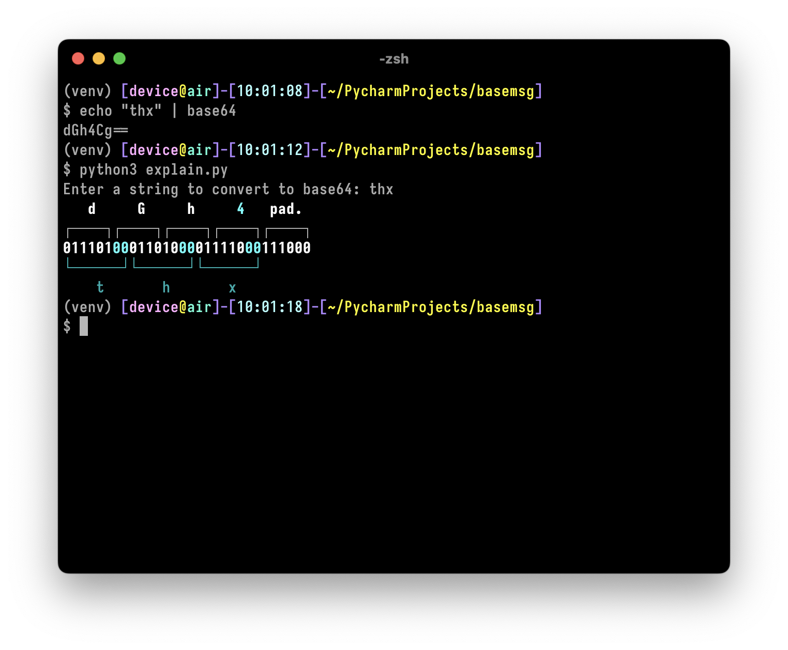
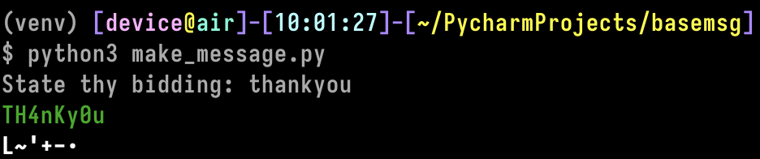

### Creditz
Based on https://n0.lol/encmute/

### Disclaimer

The implementation is poor, and there's no intention to improve it.
This was done mostly for fun 🦧

### Runnnn like
1. `pip install -r requirements.txt`
2. `python3 explain.py` then enter a string to see how it would be converted to base64

3. `python3 make_message.py` then enter a string and the script will try to find an ascii printable string that would be encoded in base64 similar to your input

